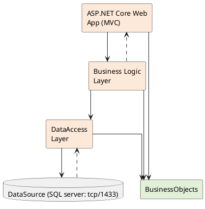

# Demo web application mvc

## 1. Introduction

- IDE : VSCode or Visual Studio 2022
- Database: SQL server, MySQL ...
- Install Package: Entity Framework Core
- CRUD object (EF)
- Code first
  
## 2. Objectives

- Use the Visual Studio.NET to create ASP.NET Core Web App (MVC) and Class Library (.dll) projects.
- Create a SQL Server database named MyStoreDB that has a Product, Category, AccountMember tables.
- Apply Repository pattern in a project.
- Add CRUD action methods to ASP.NET Core Web App (MVC).
- Run the project and test the application actions.
  
## 3. Database Design

- Entity: AccountMember

| Field          | Type | Key | Description        |
| -------------- | ---- | --- | ------------------ |
| MemberID       | PK   | ✔   | Mã thành viên      |
| MemberPassword | Text |     | Mật khẩu           |
| FullName       | Text |     | Họ và tên          |
| EmailAddress   | Text |     | Địa chỉ email      |
| MemberRole     | Text |     | Vai trò thành viên |

- Entity: Categories

| Field        | Type | Key | Description  |
| ------------ | ---- | --- | ------------ |
| CategoryID   | PK   | ✔   | Mã danh mục  |
| CategoryName | Text |     | Tên danh mục |

- Entity: Products

| Field        | Type    | Key                     | Description           |
| ------------ | ------- | ----------------------- | --------------------- |
| ProductID    | PK      | ✔                       | Mã sản phẩm           |
| ProductName  | Text    |                         | Tên sản phẩm          |
| CategoryID   | FK      | →Categories(CategoryID) | Liên kết đến danh mục |
| UnitsInStock | Integer |                         | Số lượng còn lại      |
| UnitPrice    | Decimal |                         | Đơn giá               |

- Sql script

    ```sql
    -- Bảng AccountMember
    CREATE TABLE AccountMember (
        MemberID INT PRIMARY KEY,
        MemberPassword VARCHAR(255) NOT NULL,
        FullName VARCHAR(100),
        EmailAddress VARCHAR(100),
        MemberRole VARCHAR(50)
    );

    -- Bảng Categories
    CREATE TABLE Categories (
        CategoryID INT PRIMARY KEY,
        CategoryName VARCHAR(100) NOT NULL
    );

    -- Bảng Products
    CREATE TABLE Products (
        ProductID INT PRIMARY KEY,
        ProductName VARCHAR(100) NOT NULL,
        CategoryID INT,
        UnitsInStock INT,
        UnitPrice DECIMAL(10, 2),
        FOREIGN KEY (CategoryID) REFERENCES Categories(CategoryID)
    );
    ```

- UML Class Diagram
- ORM

```
plantuml
@startuml
class AccountMember {
    +MemberID : int
    +MemberPassword : string
    +FullName : string
    +EmailAddress : string
    +MemberRole : string
}

class Categories {
    +CategoryID : int
    +CategoryName : string
}

class Products {
    +ProductID : int
    +ProductName : string
    +CategoryID : int
    +UnitsInStock : int
    +UnitPrice : decimal
}

Categories "1" -- "0..*" Products : has
@enduml
```

## 4. Create MVC with 3 layer

- Create a Blank Solution named MyStore then add new a Class Library project named:
- MyStore.Business
- MyStore.Repositories
- MyStore.Services
- ASP.NET Core Web App (MVC) project named MyStore.WebApp
Step 01. Create a Blank solution.
Step 02. Create 4 Class Library projects.
Step 03. Create a project (ASP.NET Core Web App MVC).



### Note

- Data Source in this case is the SQL Server Database
- Services Project: This project represents a layer or component responsible for implementing the business logic of an application.
- Repository Project: This project provides an abstraction layer between the application’s business logic and the underlying data source.
- Data Access Layer Project: This project used to abstract and encapsulate the  logic for accessing data from a data source, such as a database.

## 5. Write codes for the BusinessObjects project

Step 01. Install the following packages from NuGet:

- Microsoft.EntityFrameworkCore.SqlServer --version 8.0.2
- Microsoft.EntityFrameworkCore.Tools --version 8.0.2
- Microsoft.Extensions.Configuration.Json --version 8.0.0

Check the tool for EFCore (install/uninstall tool if needed) (dotnet SDK 8.0.202)

Install EF (versoin 8) = .Net (8)

<!-- markdownlint-disable code-block-style -->
    dotnet tool install --global 
    dotnet-ef --version 8.0.2
    dotnet tool uninstall --global 

<!-- markdownlint-restore -->
## 6. Implement ORM (Folder Business Logic Layer)


<!-- markdownlint-disable code-block-style -->
    dotnet ef dbcontext scaffold "Data Source=127.0.0.1,1433;Initial Catalog=MyStoreDB; Uid=sa; Pwd=Aa@123456;;TrustServerCertificate=true" Microsoft.EntityFrameworkCore.SqlServer --output-dir ./ 
    
<!-- markdownlint-restore -->
- Change the connection string in OnConfiguring() function of MyStoreContext.cs

    ```csharp
    using System.IO;
    using Microsoft.Extensions.Configuration.Json;

    private string GetConnectionString()
    {
        IConfiguration configuration = new ConfigurationBuilder()
                .SetBasePath(Directory.GetCurrentDirectory())
                .AddJsonFile("appsettings.json", true, true).Build();
            return configuration["ConnectionStrings:DefaultConnectionString"];
    }

    protected override void OnConfiguring(DbContextOptionsBuilder optionsBuilder)
    {
        optionsBuilder.UseSqlServer(GetConnectionString());
    }
    ```

    ```csharp
    //Category.cs
    public partial class Category
    {
        public int CategoryId { get; set; }

        public string CategoryName { get; set; } = null!;

        public virtual ICollection<Product> Products { get; set; } = new List<Product>();
    }
    ```
